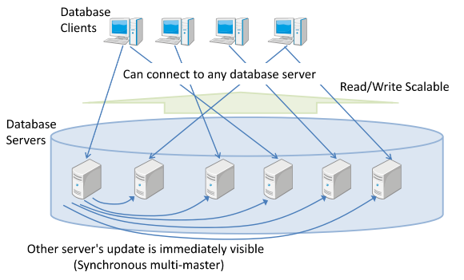
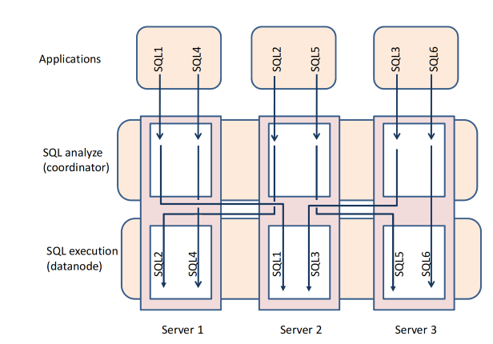
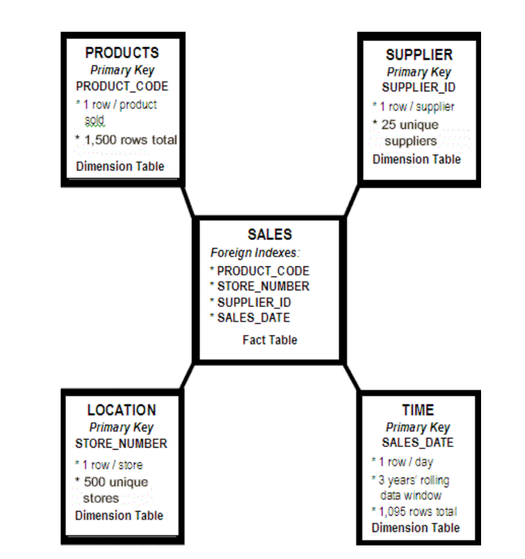
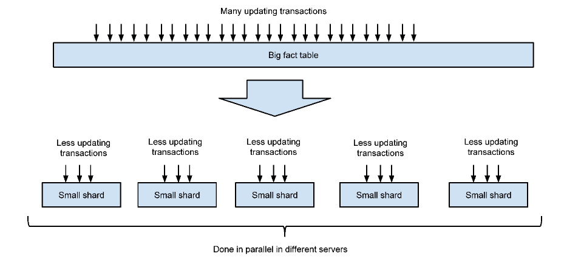
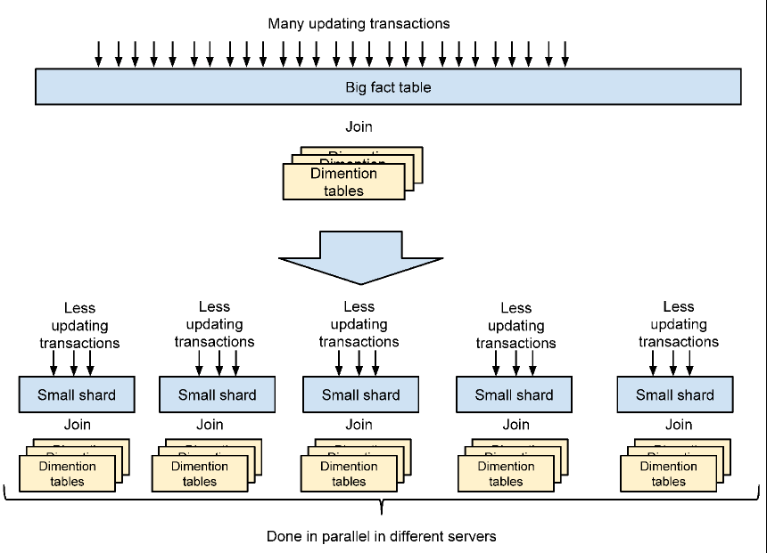
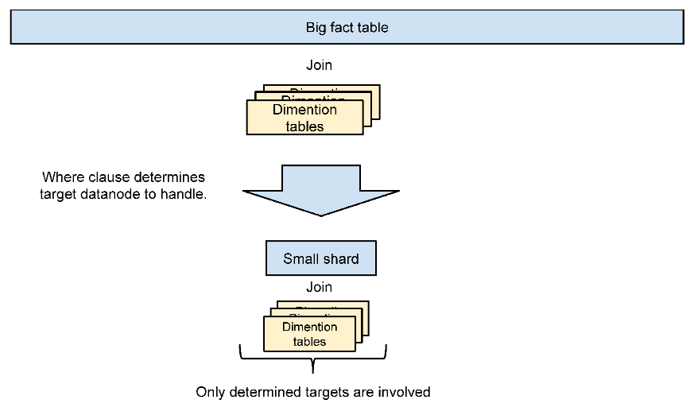

# 第一章节 Postgres-XC 架构

## 1.1 什么是Postgres-XC
Postgres-XC是一个开源项目，旨在提供水平可扩展性，包括写入可扩展性、同步多主模式和透明的PostgreSQL接口。它是一组紧密耦合的数据库组件，可以安装在多个硬件或虚拟机中。

写入可扩展性意味着Postgres-XC可以配置尽可能多的数据库服务器，并处理比单个数据库服务器能够处理的更多的写入（更新SQL语句）。多主模式意味着您可以拥有多个数据库服务器，它们提供单一的数据库视图。同步意味着任何数据库服务器的任何数据库更新都会立即对在不同主服务器上运行的其他事务可见。透明意味着您无需担心您的数据如何在多个数据库服务器内部存储。

您可以配置Postgres-XC在多个物理或虚拟服务器上运行。它们以分布式的方式存储您的数据，即您可以配置每个表是分区存储还是复制存储。当您发出查询时，Postgres-XC确定目标数据存储的位置，并向拥有目标数据的服务器发出适当的SQL语句。这在图1.1中显示。

在典型的Web应用程序中，您可以使用任意数量的Web服务器或应用服务器来处理您的事务。通常，您无法对数据库服务器这样做，因为数据库的所有更新必须对所有事务可见。与其他数据库集群解决方案不同，Postgres-XC提供了这种能力。您可以安装任意多的数据库服务器。每个数据库服务器为您的应用程序提供统一的数据视图。任何服务器的数据库更新都会立即对连接到其他服务器的数据库的应用程序可见。这个特性被称为“同步多主”能力，这是Postgres-XC最重要的特性，如图1.1所示。

Postgres-XC基于PostgreSQL数据库系统，并使用包括应用程序接口、解析器、重写器、规划器和执行器在内的大部分现有模块。这样，Postgres-XC的应用程序接口与现有的PostgreSQL兼容。（如后文所述，目前，由于架构的分布式特性，Postgres-XC对SQL语句有一些限制。这将在将来得到改进）。

## 1.2 Postgres-XC目标
Postgres-XC的终极目标是提供一个具有读写可扩展性的同步多主PostgreSQL集群。也就是说，Postgres-XC应该提供以下特性：

- Postgres-XC应该允许多个服务器接受来自应用程序的事务和语句，通常被称为“主”服务器。在Postgres-XC中，这些组件被称为“协调器”。

- 任何协调器都应该为应用程序提供一致的数据库视图。任何主服务器的更新都必须以实时方式可见，就好像这些更新是在单个PostgreSQL服务器上完成的。

- 表应该能够以复制或分布式的方式（称为片段、分片或分区）存储在数据库中。复制和分布应该对应用程序透明，即这些复制和分布式表被视为单个表，每个记录/元组的位置或副本数量由Postgres-XC管理，对应用程序不可见。

- Postgres-XC应该为应用程序提供兼容的PostgreSQL API。

- Postgres-XC应该提供单一且统一的底层PostgreSQL数据库服务器视图，以便SQL语句不依赖于表是如何以分布式方式存储的。

到目前为止，Postgres-XC的成就如下：

1. 事务管理几乎已经完成。PostgreSQL提供了完整的“读已提交”事务隔离级别，其行为与单个PostgreSQL服务器完全相同。未来应该添加可重复读、可串行化和客户端保存点。 （译者注：当前tbase已经支持可重复读，TDSQL在官网说支持可串行化）

2. 主要的语句特性都是可用的。一些特性，例如包括WHERE CURRENT OF的完整游标特性、分布式表的完整约束支持以及保存点等，目前还不支持。其中一些特性的背景是表的分布和复制的特性。

## 1.3 如何扩展读取与写入
简单来说，并行性是可扩展性的关键。对于并行性，事务控制是关键技术。

我们将比较PostgreSQL的事务控制与传统的复制集群，并展示Postgres-XC如何在多个节点中安全地运行更新事务，然后展示主要的Postgres-XC组件，并最终展示如何设计数据库以并行运行事务。

### 1.3.1 Postgres-XC中的并行性
并行性是实现Postgres-XC写入可扩展性的关键。

在内部，Postgres-XC分析传入的SQL语句，并选择哪个服务器可以处理它。这是通过一个叫做“协调器”的组件完成的。实际的语句处理是由一个叫做“数据节点”的组件完成的。在典型的事务性应用中，每个事务读取/写入少量的元组，并且必须处理大量的事务。在这种情况下，我们可以设计数据库，使得一个或少数几个数据节点参与处理每个语句。

通过这种方式，如图1.2所示，Postgres-XC服务器并行处理语句，从而扩展事务吞吐量。正如本文档后面介绍的，使用十个服务器，总吞吐量可以与单服务器PostgreSQL相比达到原始的6.4倍。请注意，这是通过使用传统的DBT-1基准测试完成的，其中既包括读取操作也包括写入操作。图1.2显示，当前的Postgres-XC适合于PostgreSQL Wiki页面中描述的事务性用例。通过改进支持的SQL语句，我们期望Postgres-XC可以适用于分析性用例。

### 1.3.2 星型模式

有一种典型的数据库架构结构叫做星型模式。

它在许多数据仓库和OLTP应用中都能找到。星型模式由少数几个大型的“事实”表和许多较小的“维度”表组成。例如，销售数据库可能包括“销售事实”作为事实表，以及“产品维度”和“商店维度”表作为维度表。事实表体积庞大且更新频繁。另一方面，维度表与事实表相比，体积较小且更加稳定。图1.3展示了典型的星型模式。

Postgres-XC的架构是为了利用星型模式的特点而构建的。通常，如果有多张事实表，它们倾向于共享候选键。在Postgres-XC中，使用这样的一个共同候选键来分片事实表是可取的。通过这种方式，我们可以将一个（或少数几个）大型表分割成较小的部分，并存储在不同的服务器（数据节点）中。用来确定每行数据应该去哪个数据节点的列被称为分布键。然后，多个事务的更新可以在多个数据节点中并行执行。

通过增加更多的数据节点，我们可以并行地对事实表执行更多的更新。这基本上是Postgres-XC提供写入可扩展性的背景。图1.4说明了这一点。

如图1.5所示，我们将所有维度表复制到所有数据节点上。因为大多数连接是在事实表和维度表之间进行的，或者是在涉及分发键的事实表之间进行的，我们可以将一个大连接转换为在每个数据节点上并行执行的每个分片和复制表之间的较小连接的联合。这就是 Postgres-XC 提供读可扩展性的方式。

如果一个语句在 WHERE 子句中具有额外的谓词，这些谓词有助于定位存储目标行的数据节点，那么 Postgres-XC 可以选择只执行这样的查询的几个数据节点。这在许多 OLTP 工作负载中都能找到。

图1.6说明了这一点。

可能会有特殊情况，应用程序需要在不涉及分发键的情况下连接事实表。在这种情况下，Postgres-XC 尽可能将尽可能多的操作下推到每个数据节点，并在顶层（协调器）执行最终的连接操作。

换句话说，如果一个应用程序不能利用这个星型模式，那么它就不适合 Postgres-XC。

### 1.3.3 复制表更新：主节点
由于日志传送复制存在延迟，强制执行一致的可见性非常具有挑战性，并且在复制表更新中使用日志传送并不实际。
为了在复制表中强制执行数据完整性，Postgres-XC 使用了一种称为“主节点”的技术。
它通过以下步骤完成。

1. 指定特定数据节点作为“主节点”。
2. 对复制表的任何写入都应首先发送到主节点。
3. 如果存在任何冲突的更新，此类更新将在主节点处被阻塞，并且冲突的更新不会传播到其他数据节点，直到当前更新事务被提交或中止。

请注意，这与基于语句的复制一起工作。这种技术类似于 pgpool-II 的并行模式中使用的技术。

### 1.3.4 DDL的传播
在 Postgres-XC 中，大多数 DDL 应该传播到其他协调器和数据节点。例外的是用于节点管理的 DDL，例如 CREATE NODE 和 ALTER NODE。节点管理 DDL 应该在每个协调器/数据节点相互了解之前运行，自动传播被确定为不实际的操作。

这个限制不是来自架构，而只是一个实现问题。将来，可能会有一个扩展，使节点管理 DDL 自动传播到其他节点。

### 1.3.5 分片和副本的系统目录
在 Postgres-XC 中，每个表可以被定义为“分布式”或“复制表”的，使用 CREATE TABLE 语句和 ALTER TABLE 语句。分布式表对应于星型模式中的事实表，复制表对应于维度表。分布式表使用分发键被划分为分片，并存储在指定的节点中。你可以通过哈希、取模或轮询的方式来指定如何定位每一行。复制表被复制到指定的一组节点，并且其内容被维护为逻辑上等价。

Postgres-XC 使用额外的系统目录 pgxc_class 来存储每个表的分片和复制信息。这可以是 pg_class 的扩展。

Postgres-XC 选择在一个单独的目录中拥有它，以便尽可能独立地维护 PostgreSQL 和 Postgres-XC 的变更。

### 1.3.6 来自分片和复制的限制
如第1.3.7节所述，Postgres-XC使用SQL语句来指示其他节点执行操作。因此，Postgres-XC有以下限制：

1. OID值可能在节点之间不同。例如，你不应该期望pg_class条目的OID值和系统目录中的其他OID值在节点之间是相同的。如果你创建了一个带有OID的复制表，那么OID值将在节点之间不同。
2. 在复制表中，给定行的CTIDs可能在节点之间不同。
3. 分布式表的每个分片具有与PostgreSQL中继承表类似的特征。跨分片的约束不是简单地支持的。目前，如果分布列没有包含在索引列中，Postgres-XC不支持分布式表中的唯一索引。出于同样的原因，除非能够保证在本地维护，否则不支持分布式表之间的引用完整性。

特定SQL语句的限制和注意事项将在另一份材料中给出。

### 1.3.7 Postgres-XC 的全局事务管理
本节描述了如何在 Postgres-XC 中强制执行事务更新和可见性。你可能需要熟悉 PostgreSQL 事务管理基础设施的内部，例如 XID、快照、xmin 和 xmax。这些信息可以在 "MVCC revealed" 中找到，该文档可在 http://momjian.us/main/writings/pgsql/mvcc.pdf 获取。

在复制集群中，你可以在多个备用或从服务器上并行运行读取事务。复制服务器提供读取可扩展性。然而，你不能向备用服务器发出写事务，因为它们没有被授予从服务器中更改的手段。除非向单一主服务器发出写事务，否则它们无法为应用程序维护数据库的一致视图。

***Postgres-XC 是不同的。***

Postgres-XC 配备了全局事务管理能力，它为在协调器（主服务器）上运行的事务以及实际存储目标数据并执行语句的节点（称为数据节点）提供集群范围内的事务排序和集群范围内的事务状态。这维持了分布式事务的 ACID 属性，并为读取多个节点的事务提供了原子的可见性。

### 1.3.8 基于语句的复制和分片
目前，Postgres-XC 通过发送 SQL 语句到其他节点来读写表。关于这是否是正确的选择，或者我们是否应该使用内部计划树来传输到其他节点，有很多讨论。

对 PostgreSQL 动态行为的内部分析表明，在典型的 OLTP 工作负载中，大约 30% 的 CPU 资源被用于解析和计划语句。节省这些资源看起来很不错。另一方面，序列化的计划树可能非常大，这会遭受网络工作负载的影响。我们还需要在整个 Postgres-XC 集群中维护所有内部信息，如 Oids 和 ctids，这并不简单。它们是 Postgres-XC 选择从一个节点发送语句到另一个节点的主要原因。

由于此原因以及事务和语句的并行性，Postgres-XC 不维护每个对象和行的 Oids 和 ctids。