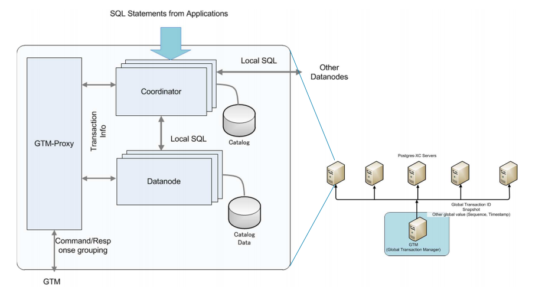
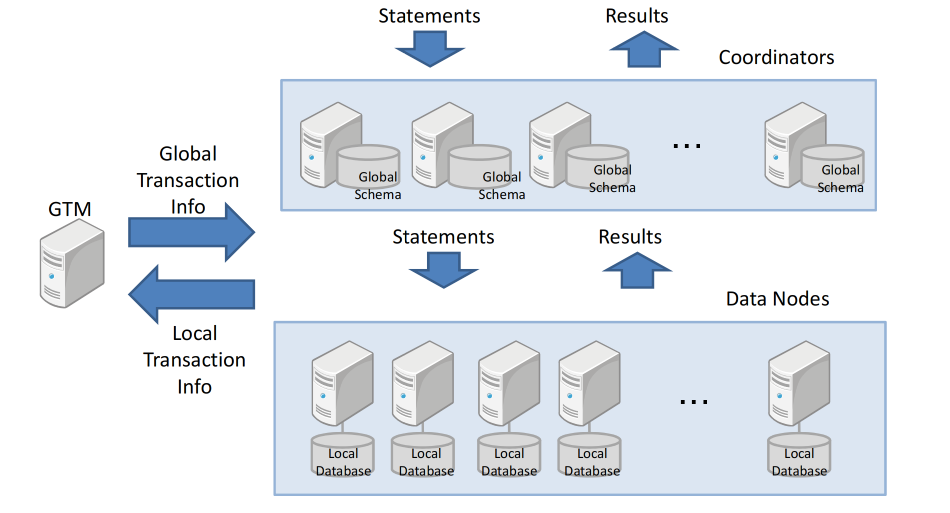
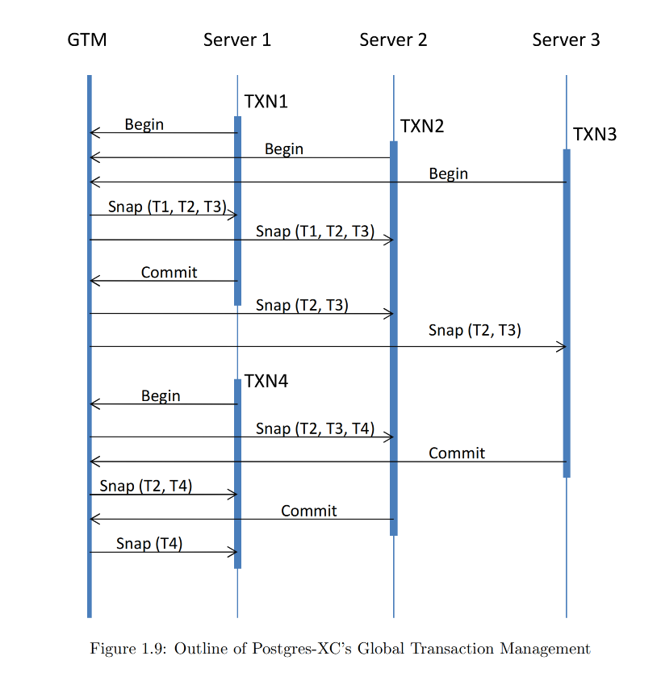
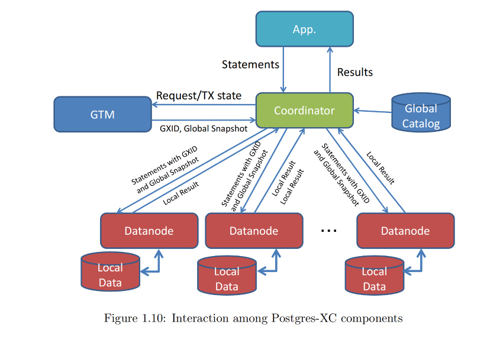
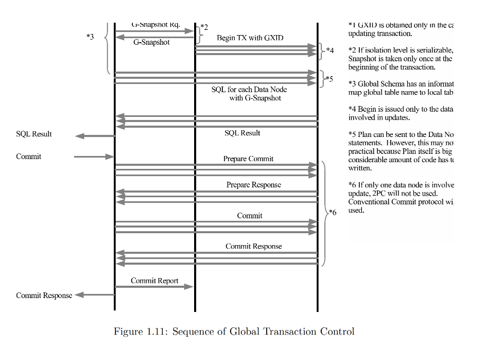
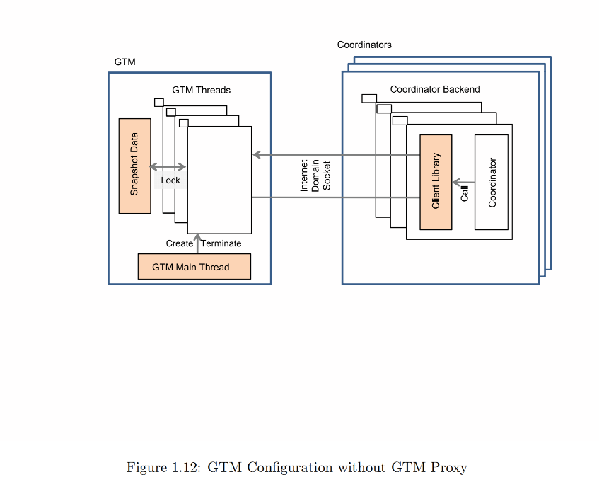
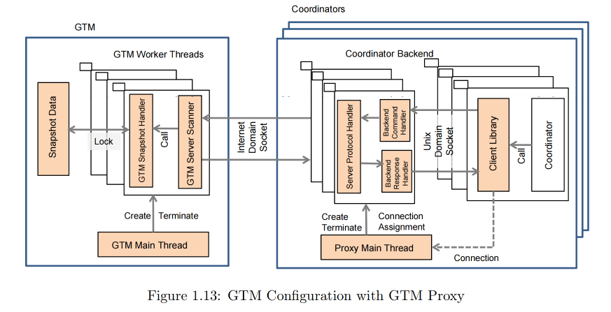

# 第一章节 Postgres-XC 架构

## 1.1 什么是Postgres-XC
Postgres-XC是一个开源项目，旨在提供水平可扩展性，包括写入可扩展性、同步多主模式和透明的PostgreSQL接口。它是一组紧密耦合的数据库组件，可以安装在多个硬件或虚拟机中。

写入可扩展性意味着Postgres-XC可以配置尽可能多的数据库服务器，并处理比单个数据库服务器能够处理的更多的写入（更新SQL语句）。多主模式意味着您可以拥有多个数据库服务器，它们提供单一的数据库视图。同步意味着任何数据库服务器的任何数据库更新都会立即对在不同主服务器上运行的其他事务可见。透明意味着您无需担心您的数据如何在多个数据库服务器内部存储。

您可以配置Postgres-XC在多个物理或虚拟服务器上运行。它们以分布式的方式存储您的数据，即您可以配置每个表是分区存储还是复制存储。当您发出查询时，Postgres-XC确定目标数据存储的位置，并向拥有目标数据的服务器发出适当的SQL语句。这在图1.1中显示。


在典型的Web应用程序中，您可以使用任意数量的Web服务器或应用服务器来处理您的事务。通常，您无法对数据库服务器这样做，因为数据库的所有更新必须对所有事务可见。与其他数据库集群解决方案不同，Postgres-XC提供了这种能力。您可以安装任意多的数据库服务器。每个数据库服务器为您的应用程序提供统一的数据视图。任何服务器的数据库更新都会立即对连接到其他服务器的数据库的应用程序可见。这个特性被称为“同步多主”能力，这是Postgres-XC最重要的特性，如图1.1所示。

Postgres-XC基于PostgreSQL数据库系统，并使用包括应用程序接口、解析器、重写器、规划器和执行器在内的大部分现有模块。这样，Postgres-XC的应用程序接口与现有的PostgreSQL兼容。（如后文所述，目前，由于架构的分布式特性，Postgres-XC对SQL语句有一些限制。这将在将来得到改进）。

## 1.2 Postgres-XC目标
Postgres-XC的终极目标是提供一个具有读写可扩展性的同步多主PostgreSQL集群。也就是说，Postgres-XC应该提供以下特性：

- Postgres-XC应该允许多个服务器接受来自应用程序的事务和语句，通常被称为“主”服务器。在Postgres-XC中，这些组件被称为“协调器”。

- 任何协调器都应该为应用程序提供一致的数据库视图。任何主服务器的更新都必须以实时方式可见，就好像这些更新是在单个PostgreSQL服务器上完成的。

- 表应该能够以复制或分布式的方式（称为片段、分片或分区）存储在数据库中。复制和分布应该对应用程序透明，即这些复制和分布式表被视为单个表，每个记录/元组的位置或副本数量由Postgres-XC管理，对应用程序不可见。

- Postgres-XC应该为应用程序提供兼容的PostgreSQL API。

- Postgres-XC应该提供单一且统一的底层PostgreSQL数据库服务器视图，以便SQL语句不依赖于表是如何以分布式方式存储的。

到目前为止，Postgres-XC的成就如下：

1. 事务管理几乎已经完成。PostgreSQL提供了完整的“读已提交”事务隔离级别，其行为与单个PostgreSQL服务器完全相同。未来应该添加可重复读、可串行化和客户端保存点。 （译者注：当前tbase已经支持可重复读，TDSQL在官网说支持可串行化）

2. 主要的语句特性都是可用的。一些特性，例如包括WHERE CURRENT OF的完整游标特性、分布式表的完整约束支持以及保存点等，目前还不支持。其中一些特性的背景是表的分布和复制的特性。

## 1.3 如何扩展读取与写入
简单来说，并行性是可扩展性的关键。对于并行性，事务控制是关键技术。

我们将比较PostgreSQL的事务控制与传统的复制集群，并展示Postgres-XC如何在多个节点中安全地运行更新事务，然后展示主要的Postgres-XC组件，并最终展示如何设计数据库以并行运行事务。

### 1.3.1 Postgres-XC中的并行性
并行性是实现Postgres-XC写入可扩展性的关键。

在内部，Postgres-XC分析传入的SQL语句，并选择哪个服务器可以处理它。这是通过一个叫做“协调器”的组件完成的。实际的语句处理是由一个叫做“数据节点”的组件完成的。在典型的事务性应用中，每个事务读取/写入少量的元组，并且必须处理大量的事务。在这种情况下，我们可以设计数据库，使得一个或少数几个数据节点参与处理每个语句。

通过这种方式，如图1.2所示，Postgres-XC服务器并行处理语句，从而扩展事务吞吐量。正如本文档后面介绍的，使用十个服务器，总吞吐量可以与单服务器PostgreSQL相比达到原始的6.4倍。请注意，这是通过使用传统的DBT-1基准测试完成的，其中既包括读取操作也包括写入操作。图1.2显示，当前的Postgres-XC适合于PostgreSQL Wiki页面中描述的事务性用例。通过改进支持的SQL语句，我们期望Postgres-XC可以适用于分析性用例。

### 1.3.2 星型模式

有一种典型的数据库架构结构叫做星型模式。

它在许多数据仓库和OLTP应用中都能找到。星型模式由少数几个大型的“事实”表和许多较小的“维度”表组成。例如，销售数据库可能包括“销售事实”作为事实表，以及“产品维度”和“商店维度”表作为维度表。事实表体积庞大且更新频繁。另一方面，维度表与事实表相比，体积较小且更加稳定。图1.3展示了典型的星型模式。

Postgres-XC的架构是为了利用星型模式的特点而构建的。通常，如果有多张事实表，它们倾向于共享候选键。在Postgres-XC中，使用这样的一个共同候选键来分片事实表是可取的。通过这种方式，我们可以将一个（或少数几个）大型表分割成较小的部分，并存储在不同的服务器（数据节点）中。用来确定每行数据应该去哪个数据节点的列被称为分布键。然后，多个事务的更新可以在多个数据节点中并行执行。


通过增加更多的数据节点，我们可以并行地对事实表执行更多的更新。这基本上是Postgres-XC提供写入可扩展性的背景。图1.4说明了这一点。


如图1.5所示，我们将所有维度表复制到所有数据节点上。因为大多数连接是在事实表和维度表之间进行的，或者是在涉及分发键的事实表之间进行的，我们可以将一个大连接转换为在每个数据节点上并行执行的每个分片和复制表之间的较小连接的联合。这就是 Postgres-XC 提供读可扩展性的方式。


如果一个语句在 WHERE 子句中具有额外的谓词，这些谓词有助于定位存储目标行的数据节点，那么 Postgres-XC 可以选择只执行这样的查询的几个数据节点。这在许多 OLTP 工作负载中都能找到。

图1.6说明了这一点。


可能会有特殊情况，应用程序需要在不涉及分发键的情况下连接事实表。在这种情况下，Postgres-XC 尽可能将尽可能多的操作下推到每个数据节点，并在顶层（协调器）执行最终的连接操作。

换句话说，如果一个应用程序不能利用这个星型模式，那么它就不适合 Postgres-XC。

### 1.3.3 复制表更新：主节点
由于日志传送复制存在延迟，强制执行一致的可见性非常具有挑战性，并且在复制表更新中使用日志传送并不实际。
为了在复制表中强制执行数据完整性，Postgres-XC 使用了一种称为“主节点”的技术。
它通过以下步骤完成。

1. 指定特定数据节点作为“主节点”。
2. 对复制表的任何写入都应首先发送到主节点。
3. 如果存在任何冲突的更新，此类更新将在主节点处被阻塞，并且冲突的更新不会传播到其他数据节点，直到当前更新事务被提交或中止。

请注意，这与基于语句的复制一起工作。这种技术类似于 pgpool-II 的并行模式中使用的技术。

### 1.3.4 DDL的传播
在 Postgres-XC 中，大多数 DDL 应该传播到其他协调器和数据节点。例外的是用于节点管理的 DDL，例如 CREATE NODE 和 ALTER NODE。节点管理 DDL 应该在每个协调器/数据节点相互了解之前运行，自动传播被确定为不实际的操作。

这个限制不是来自架构，而只是一个实现问题。将来，可能会有一个扩展，使节点管理 DDL 自动传播到其他节点。

### 1.3.5 分片和副本的系统目录
在 Postgres-XC 中，每个表可以被定义为“分布式”或“复制表”的，使用 CREATE TABLE 语句和 ALTER TABLE 语句。分布式表对应于星型模式中的事实表，复制表对应于维度表。分布式表使用分发键被划分为分片，并存储在指定的节点中。你可以通过哈希、取模或轮询的方式来指定如何定位每一行。复制表被复制到指定的一组节点，并且其内容被维护为逻辑上等价。

Postgres-XC 使用额外的系统目录 pgxc_class 来存储每个表的分片和复制信息。这可以是 pg_class 的扩展。

Postgres-XC 选择在一个单独的目录中拥有它，以便尽可能独立地维护 PostgreSQL 和 Postgres-XC 的变更。

### 1.3.6 来自分片和复制的限制
如第1.3.7节所述，Postgres-XC使用SQL语句来指示其他节点执行操作。因此，Postgres-XC有以下限制：

1. OID值可能在节点之间不同。例如，你不应该期望pg_class条目的OID值和系统目录中的其他OID值在节点之间是相同的。如果你创建了一个带有OID的复制表，那么OID值将在节点之间不同。
2. 在复制表中，给定行的CTIDs可能在节点之间不同。
3. 分布式表的每个分片具有与PostgreSQL中继承表类似的特征。跨分片的约束不是简单地支持的。目前，如果分布列没有包含在索引列中，Postgres-XC不支持分布式表中的唯一索引。出于同样的原因，除非能够保证在本地维护，否则不支持分布式表之间的引用完整性。

特定SQL语句的限制和注意事项将在另一份材料中给出。

### 1.3.7 Postgres-XC 的全局事务管理
本节描述了如何在 Postgres-XC 中强制执行事务更新和可见性。你可能需要熟悉 PostgreSQL 事务管理基础设施的内部，例如 XID、快照、xmin 和 xmax。这些信息可以在 "MVCC revealed" 中找到，该文档可在 http://momjian.us/main/writings/pgsql/mvcc.pdf 获取。

在复制集群中，你可以在多个备用或从服务器上并行运行读取事务。复制服务器提供读取可扩展性。然而，你不能向备用服务器发出写事务，因为它们没有被授予从服务器中更改的手段。除非向单一主服务器发出写事务，否则它们无法为应用程序维护数据库的一致视图。

***Postgres-XC 是不同的。***

Postgres-XC 配备了全局事务管理能力，它为在协调器（主服务器）上运行的事务以及实际存储目标数据并执行语句的节点（称为数据节点）提供集群范围内的事务排序和集群范围内的事务状态。这维持了分布式事务的 ACID 属性，并为读取多个节点的事务提供了原子的可见性。

### 1.3.8 基于语句的复制和分片
目前，Postgres-XC 通过发送 SQL 语句到其他节点来读写表。关于这是否是正确的选择，或者我们是否应该使用内部计划树来传输到其他节点，有很多讨论。

对 PostgreSQL 动态行为的内部分析表明，在典型的 OLTP 工作负载中，大约 30% 的 CPU 资源被用于解析和计划语句。节省这些资源看起来很不错。另一方面，序列化的计划树可能非常大，这会遭受网络工作负载的影响。我们还需要在整个 Postgres-XC 集群中维护所有内部信息，如 Oids 和 ctids，这并不简单。它们是 Postgres-XC 选择从一个节点发送语句到另一个节点的主要原因。

由于此原因以及事务和语句的并行性，Postgres-XC 不维护每个对象和行的 Oids 和 ctids。

## 1.4 Postgres-XC 关键组件
本节将描述 Postgres-XC 的主要组件。

Postgres-XC 由三个主要组件组成，称为 GTM（全局事务管理器）、协调器和数据节点，如图1.7所示。它们的特点在以下各节中给出。


图1.8概述了每个关键组件如何相互作用。



### 1.4.1 GTM（全局事务管理器）
GTM 是 Postgres-XC 的关键组件，用于提供一致的事务管理和元组可见性控制。首先，我们将介绍 PostgreSQL 如何管理事务和数据库更新。

#### 1.4.1.1 PostgreSQL如何管理事务

在PostgreSQL中，每个事务都被赋予一个唯一的ID，称为事务ID（或XID）。XID是按升序分配的，以确定哪个事务是旧的/新的。请让我们详细描述一下这是如何完成的。

当一个事务尝试读取一个元组时，每个元组都有一组XID来指示创建和删除该元组的事务。因此，如果目标元组是由一个活跃的事务创建的，它还没有提交或中止，读取事务应该忽略这样的元组。以这种方式（在实践中，这是通过PostgreSQL核心的tqual.c模块完成的），如果我们给系统中的每个事务一个唯一的事务ID，并维护快照，显示哪个事务是活跃的，不仅在单个服务器上，而且在所有服务器上的事务，我们就可以维护每个元组的全局一致的可见性，即使一个服务器接受来自在其他服务器上运行的其他事务的新语句。

这些信息存储在每个表行的“xmin”和“xmax”字段中。当我们插入行时，插入事务的XID记录在xmin字段中。当我们更新表的行（使用UPDATE或DELETE语句）时，PostgreSQL不会简单地覆盖旧行。相反，PostgreSQL通过将更新事务的XID写入xmax字段来“标记”旧行为“已删除”。

在UPDATE（就像INSERT一样）的情况下，会创建新行，其xmin字段用创建事务的XID“标记”。

这些“xmin”和“xmax”用于确定哪行对事务可见。为此，PostgreSQL需要数据来指示特定时间正在运行的事务。这称为“快照”。如果一个事务在快照中，即使它已经完成，也被视为正在运行。

你应该理解这个特定时间不仅仅是现在。如果事务的隔离级别是读已提交，事务需要在一段时间内保持一致的可见性，至少在执行SQL语句时。如果SQL语句读取在执行期间提交的一些行，这是不可取的。因此，在读取已提交隔离级别的情况下，数据库应该在执行语句之前获取快照，并在整个执行过程中继续使用它。

在可重复读和可串行化的情况下，事务需要在整个事务执行期间保持一致的可见性。在这种情况下，事务应该在执行语句之前获取快照，并在整个事务执行期间继续使用它，而不是单个语句执行。

如果创建行的事务没有运行，每行的可见性取决于创建事务是否已提交或中止。假设一个表的行是由某个事务创建的，尚未删除。如果创建事务正在运行，这样的行对创建行的事务可见，但对其他事务不可见。如果创建事务没有运行并且已提交，则该行是可见的。如果事务被中止，则此行不可见。

*因此，PostgreSQL需要两种信息来确定“哪个事务正在运行”以及“一个旧事务是否已提交或中止”。前者信息可以作为“快照”获得。PostgreSQL将后者信息维护为“CLOG”。*

PostgreSQL使用所有这些信息来确定哪一行对给定事务可见。

#### 1.4.1.2 使事务管理全球化
在Postgres-XC中，GTM为事务管理提供以下功能：

1. 为事务全局分配XID（GXID，全局事务ID）。有了GXID，全局事务可以全局识别。如果一个事务写入多个节点，我们可以跟踪这些写入。
   
2. 提供快照。GTM收集所有事务的状态（运行中、已提交、已中止等），以全局提供快照（全局快照）。请注意，全局快照包括分配给其他服务器的GXID，如图1.8所示。这是必需的，因为一些较旧的事务可能在一段时间后访问新服务器。在这种情况下，如果快照中不包括此类事务的GXID，则此事务可能被视为“足够旧”，并可能读取未提交的行。如果从一开始就将此类事务的GXID包含在快照中，则不会发生这种不一致。 我们需要全局快照的原因如下： 2PC协议强制执行每个分布式事务的更新。但是，它不强制维护分布式事务更新对其他人的一致可见性。根据每个节点提交的时间，更新可能或可能不可见于读取这些节点的同一事务。为了维护一致的可见性，我们需要一个全局快照，其中包括Postgres-XC集群中所有运行事务的信息（在这种情况下是GXID，全局事务ID），并像在PostgreSQL中找到的读操作的上下文中一样使用它。 为了实现这一点，Postgres-XC引入了一个名为GTM（全局事务管理器）的专用组件。GTM作为一个单独的组件运行，并为在Postgres-XC服务器上运行的每个事务提供唯一和有序的事务ID。我们称其为GXID（全局事务ID），因为这是一个全局唯一的ID， GTM接收来自事务的GXID请求并提供GXID。它还跟踪所有事务的开始和结束时间，以生成用于控制每个元组可见性的快照。因为这里的快照也是全局属性，所以称为全局快照。 只要每个事务都使用GXID和全局快照运行，它就可以在整个系统中维护一致的可见性，并且可以在任何服务器上并行安全地运行事务。 另一方面，由多个语句组成的事务可以使用多个服务器执行，同时保持更新和可见性的一致性。这种机制的概述如图1.9所示。请注意，每个快照中包含的事务如何根据全局事务发生变化。



GTM为每个事务提供全局事务ID，并跟踪所有事务的状态，无论是运行中、已提交还是已中止，以计算全局快照来维护元组的可见性。

请注意，每个事务报告其开始和结束的时间，以及在两阶段提交协议中发出PREPARE TRANSACTION命令的时间。

还请注意，GTM提供的全局快照包括在其他组件上运行的其他事务。

每个事务根据事务隔离级别请求快照，就像在PostgreSQL中完成的那样。如果事务隔离级别是“读已提交”，则事务将为每个语句请求一个快照。如果是“可重复读”，则事务将在事务开始时请求一个快照，并在整个事务中重复使用它。

GTM还提供诸如序列之类的全局值。其他全局属性，如时间戳和通知，将在后续版本中扩展。

### 1.4.2 协调器
协调器是应用程序的接口。它的行为类似于传统的PostgreSQL后端进程。然而，由于表可能被复制或分布，协调器不存储任何实际数据。实际数据由数据节点存储。

如下所述。协调器接收SQL语句，根据需要获取全局事务ID和全局快照，确定涉及哪个数据节点，并要求它们执行（全部或部分）语句。在向数据节点发布语句时，协调器传播GXID和全局快照，以便在相同的事务上下文中在数据节点上运行语句。

### 1.4.3 数据节点
数据节点实际上存储用户数据。表可以在数据节点之间分布，或者复制到所有数据节点。数据节点不处理整个数据库的全局视图，只关心本地数据。协调器构建在数据节点本地运行的语句。如后文所述，由协调器检查传入的语句，并重建以在涉及的每个数据节点上执行。然后，它与所需的GXID和全局快照一起被传输到涉及的每个数据节点。数据节点可能会收到来自各种协调器的请求。然而，由于每个事务都被唯一地识别并与一致的（全局）快照相关联，数据节点不必担心每个事务或语句来自哪个协调器。

事务控制和查询处理的总体图示如图1.10所示。



### 1.4.4 关键组件之间的交互
如前一节所解释的，Postgres-XC有三个主要组件，以提供多节点读写的全局一致性，并确定每个语句应该去哪个数据节点以及处理该语句。
全局事务控制和Postgres-XC组件之间的交互顺序在图1.11中给出。

如图中所示，当协调器开始一个新的事务时，它会向GTM请求新的事务ID（GXID，全局事务ID）。GTM跟踪此类需求以计算全局快照。
如果事务隔离模式是REPEATABLE READ，则将在事务的整个过程中获取并使用快照。当协调器从应用程序接受一个语句，并且隔离模式是READ COMMITTED时，将从GTM获取快照。然后，分析该语句，确定去哪个数据节点，并在必要时转换为每个数据节点。
请注意，为了维护全局事务身份和表中每行的可见性，语句将与GXID和全局快照一起传递给适当的数据节点。每个结果将被收集并计算到对应用程序的响应中。

在事务结束时，如果多个数据节点参与了事务中的更新，协调器将发出2PC的PREPARE TRANSACTION，然后发出COMMIT。这些步骤也将报告给GTM，以便跟踪每个事务的状态，以计算后续的全局快照。



## 1.5 GTM是否是性能瓶颈

由于GTM可以被视为“串行化”所有事务处理，它可能是一个性能瓶颈。

实际上，GTM可以限制整个可扩展性。在非常慢的网络环境中，例如广域网，不应使用GTM。GTM架构旨在与千兆本地网络一起使用。有关网络工作负载，请参见第1.7.3节。发送每个数据包的延迟可能是一个问题。我们鼓励使用具有最小延迟的本地千兆网络安装Postgres-XC，即在GTM、协调器和数据节点之间的连接中涉及的交换机尽可能少。典型配置如图1.12所示。

本章描述了Postgres-XC中GTM的一般性能问题以及GTM内部结构的替代方案。



### 1.5.1 无代理的GTM实现

图1.11中的序列可以按图1.12所示实现。协调器后端对应于PostgreSQL的后端进程，它处理来自应用程序的数据库连接并处理每个事务。
结构和算法的概述如下：

1. 协调器后端提供了GTM客户端库，以获取GXID和快照，并报告事务状态。
2. GTM打开一个端口以接受来自每个协调器后端的连接。当GTM接受连接时，它会创建一个线程（GTM线程）来处理来自连接的协调器后端的请求。
3. GTM线程接收每个请求，记录它，并向协调器后端返回GXID、快照和其他响应。
4. 直到协调器后端请求断开连接，上述序列会重复进行。

上述每个交互都是单独完成的。例如，如果协调器的数量是十个，并且每个协调器有来自应用程序的一百个连接，这在单个PostgreSQL的事务应用程序中是相当合理的，GTM必须有一千个GTM线程。如果每个后端每秒发出25个事务，每个事务包括五个语句，并且每个协调器运行一百个后端，那么GTM和十个协调器之间提供全局快照的交互总数可以估计为：

```10 × 100 × 25 × 5 = 125,000。```

因为我们在每个协调器中有一百个后端，快照的长度（GXID是32位整数，如PostgreSQL中定义）将是 4 × 100 × 10 = 4,000字节。因此，GTM必须每秒发送约600兆字节的数据来支持这个规模。这远远大于千兆网络可以支持的14。实际上，从GTM发送的数据量是O(N^2)的顺序，其中N是协调器的数量。

不仅仅是数据量是个问题。交互次数也是个问题。非常简单的测试将显示千兆网络为每个服务器提供高达100,000次交互。
后面部分的网络工作负载测量显示数据量并不是那么大，但显然我们需要一些手段来减少交互和数据量。
下一节将解释如何在GTM中减少交互次数和数据量。

### 1.5.2 GTM代理实现

您可能已经注意到，每个事务如此频繁地向GTM发出请求，我们可以在每个协调器中将它们收集到单个请求块中，以减少交互次数。

这就是图1.13所示的GTM代理实现的想法。



在此配置中，每个协调器后端不直接连接到GTM。相反，我们在GTM和协调器后端之间有GTM代理来组合多个请求和响应。像第1.5.1节中解释的GTM一样，GTM代理接受来自协调器后端的连接。但是，它不会创建新线程。以下段落解释了如何初始化GTM代理以及它如何处理来自协调器后端的请求。
GTM代理和GTM的初始化如下：

1. GTM像第1.5.1节中描述的那样启动。现在GTM可以接受来自GTM代理的连接。
2. GTM代理启动。GTM代理创建GTM代理线程。每个GTM代理线程提前连接到GTM。可以在启动时指定GTM代理线程的数量。典型的线程数量是一或两个，这样可以节省GTM和协调器之间的连接数量。
3. GTM主线程等待每个后端的请求连接。

当每个协调器后端请求连接时，代理主线程分配一个GTM代理线程来处理请求。因此，一个GTM代理线程负责多个协调器后端。如果协调器有一个一百个协调器后端和一个GTM代理线程，那么这个线程负责一百个协调器后端。

然后GTM代理线程扫描来自协调器后端的所有请求。如果协调器更忙，预计在一次扫描中捕获更多请求。因此，代理可以将许多请求分组到单个请求块中，以减少GTM和协调器之间的交互次数。

此外，在一次扫描中，我们可能有多个快照请求。由于这些请求可以被视为同时收到，我们可以用单个快照来表示多个快照。这将减少GTM提供的数据量。